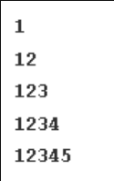

### Pattern - 3: Right-Angled Number Pyramid


### Answear
 ``` python 
 for i in range(1, 8):
    for j in range(1, i):
        print(j, end="")
    print()  

 ```
### Output
  ``` shell
    1
    12
    123
    1234
    12345
    123456