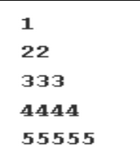

### Pattern - 4: Right-Angled Number Pyramid - II

### Answer
 ````python 
 for i in range(1, 6):
    for j in range(1, i+1):
        print(str(i) * j, end="")
    print()

````
### Output 
``` shell
1
222
333333
4444444444
555555555555555